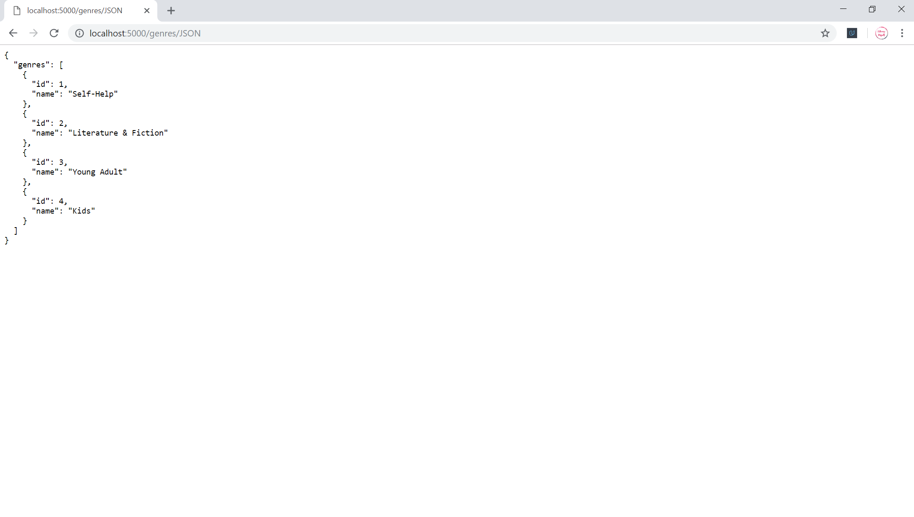
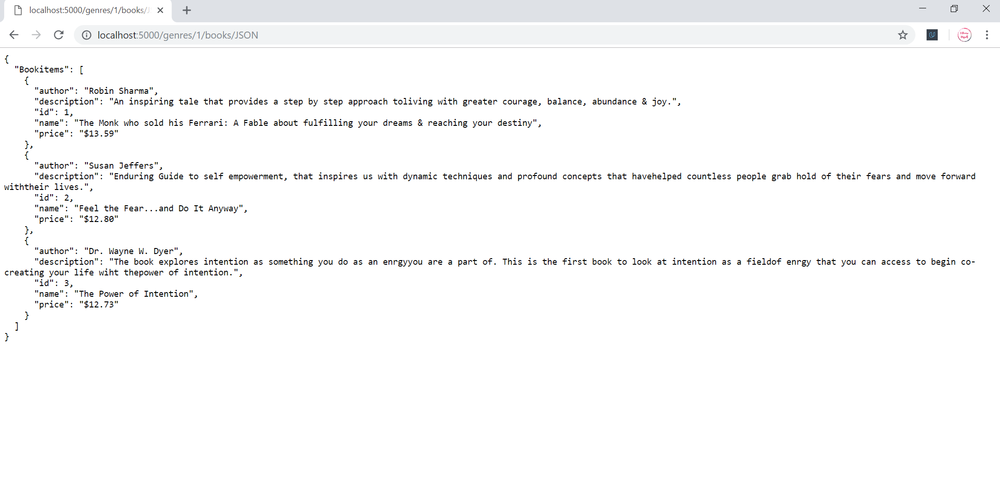
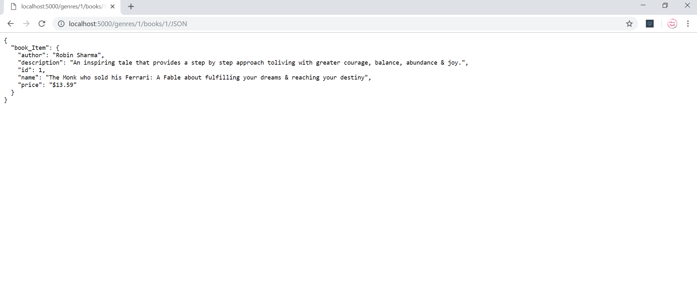

# Item Catalog Project

This project is an Udacity FSND Project. It's about developing an application that provides a list of items within a variety of categories as well as provide a user registration and authentication system. Registered users will have the ability to post, edit and delete their own items. I have developed a small Library that contains 4 genres and the books that had impact on my life after reading them.

## Operational Requirements
In order to start this project, you will need to install a virtual machine which is Linux server system that will require the following software:

* [VirtualBox](https://www.virtualbox.org/wiki/Download_Old_Builds_5_1)
* [Vagrant](https://www.vagrantup.com/)
* Git Bash for windows
As well you require:
* [Google Developer Account](https://console.developers.google.com) Creation. For this Project I have used Google Developer account for Signing in using Google API & Creating the Client ID and Secret Key.

In addition, for the code you will require background in:
* **Python**
* **HTML**
* **CSS**
* **FontAwsome**
* **SQLAlchemy**
* **JavaScript**
* **Flask**
* **AJAX**
* **JSON**
* **Jinja2**
* **OAuth**

## User Instructions
To run this application, do the following:
* Keep all the files in the same folders as they are because they are linked to each other.
* Ensure you have a Good Internet Connection to avoid disconnection issues.
* After installing the virtual machine and downloading the file, Change directory to vagrant using **cd vagrant**. Then run **vagrant up** followed by **vagrant ssh** to loging to the vagrant VM. Change directory to **/vagrant** and run **project.py** from within this directory using **python project.py** command.
* On the web browser type: **localhost:5000**. You might need to refresh the browser as google chrome sometimes cache the sessions, so on logout refresh the web page.
* For **JSON Endpoints Access**, find access information below:
 - To access all Genres Information:
   * **JSON Development Route Format:** /genres/JSON
   * As a user you can access through this link: http://localhost:5000/genres/JSON

   
  - To access all Books Information:
    * **JSON Development Route Format:** /books/JSON
    * As a user you can access through this link: http://localhost:5000/books/JSON

   
 - To access all Books of specific genre Information:
   * **JSON Development Route Format:** /genres/<int:genre_id>/books/JSON
   * As a user you can access through this link: http://localhost:5000/genres/1/books/JSON

   
 - To access specific Book Information:
   * **JSON Development Route Format:** /genres/<int:genre_id>/books/<int:book_id>/JSON
   * As a user you can access through this link: http://localhost:/genres/1/books/1/JSON

   

**NOTE:** You can change the genre_id & book_id to get different genres & books.
## Application functionality
As a user you can:
* Get Generic information on the Library Catalog from clicking on the Genre and navigating within to the book details.
* Register using your google account email, by clicking User Login in the home page, where you will be registered in the web application and can add genres, books as well update content based on your access credentials.

## For Development Resources:
If you are interested in developing such application, I can help you with the following resources where I got the understanding & Help from colleagues in the field:
* **Udacity Full Stack ND Course such as:**
  - The Backend: Databases & Applications Part 1
  - The Backend: Databases & Applications Part 2
  - The Frontend: JavaScript & AJAX.
  - Programming Fundamentals and the Web.
* **[Google Sign-In for Websites Documentation](https://developers.google.com/identity/sign-in/web/server-side-flow)**
* **[Stackoverflow Questions](https://stackoverflow.com)**
  * A Huge Knowledge Base for any help in coding, I have utilized for searches on some topics such as:
  - Flash Messages.
  - Mulitple threading Issues
  - Issues with JSON
  - Jinja2 Templates
* **[Flask Documentation & tutorials](http://flask.pocoo.org/)**
* **[jQuery Ajax Documentation](http://api.jquery.com/jquery.ajax/)**
* **Youtube Tutorials**
* **1MAC FSND Slack Community**. A community for One Million Arab Coders initiative, Monitored by Udacity and the students help each other in it with the thoughts and understanding for codes.

## Feedback
 I hope you have enjoyable experience, if you have any feedback on the README.md file you can contact me through **[Udacity Team](https://ae.udacity.com/contact)**.
